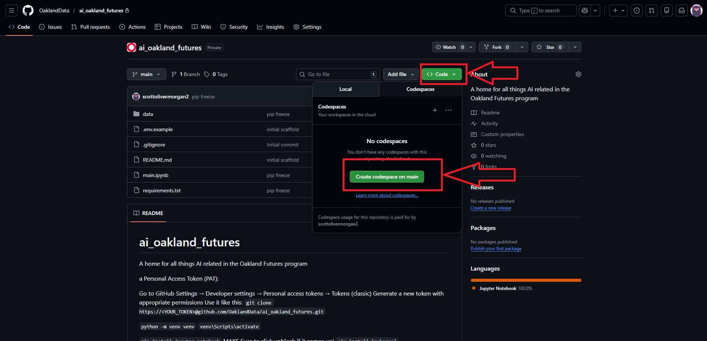
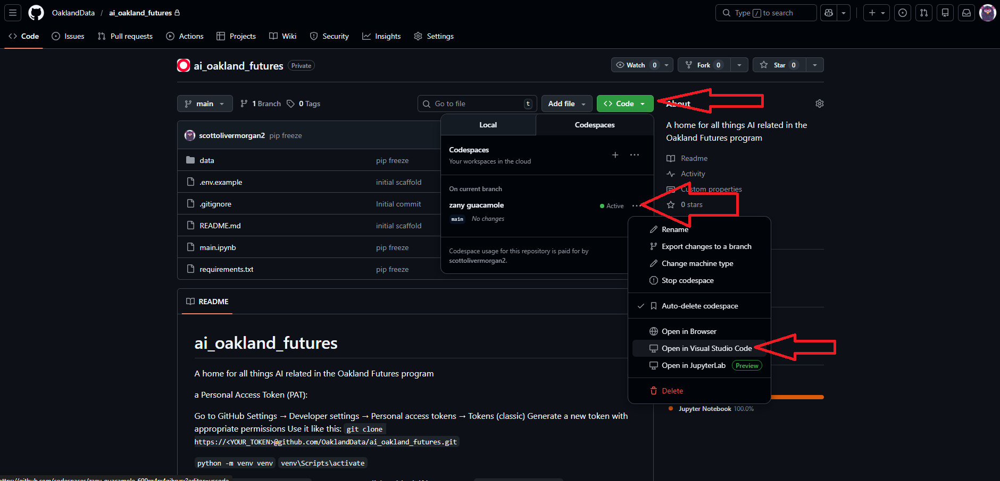
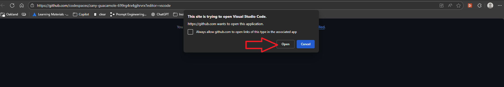
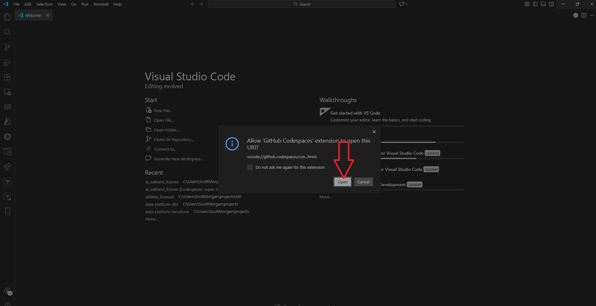
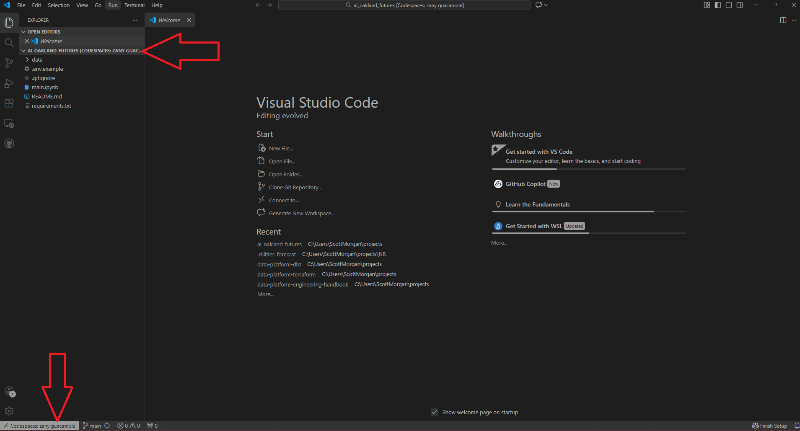
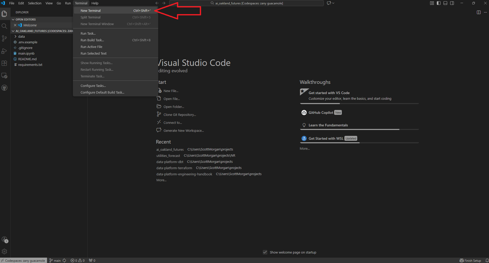

# Oakland Futures AI
## Solving data quality issues with an LLM

This workshop is an introductory, practical, **first-iteration** walkthrough of a real business use case: taking a messy dataset, exploring it to surface quality issues, using a Large Language Model (LLM) to propose fixes, and writing the results back out. The process is intended to be iterated on for improvment, and provoke some thoughts on how such a workflow coud be easily and silently integrated into a buisness process from a technical perspective.

It is written in a Python notebook but knowledge of the launguage isn't a pre-requisite and non engineers will benifit from seeing the high level view of the end to end process and also gain an appreciation for the nuanses of prompt/context engineering hands on.

Once you've worked through the notebook:
  - Explore the data set further to uncover more issues, think about how you can use the process to have the LLM actually do this for you!
  - Think about transparency here, LLMs hallucinate and get things wrong, we can manually check 100 entries but the full data set is actually 26k rows. What could we do to mitigate this risk?
  - Think about technical limitations: 
    - This is currently a seriel process.
    - How deal with Failed API calls?
    - How make idempotent as a process?
  - Think about cost, How would you give a cost estimate of this? How would that break down?

### Set Up Instuctions
This workshop is intended to be run in github codespaces to avoid any finiky set up but can easily be run locally.

#### Codespaces Set Up
- __Prerequistes__
  - VS Studio Code - you should already have this installed on your laptops but if not: https://code.visualstudio.com/
- From the main branch on this repo select the `<> Code` button, then the `Create Codespace on main` button from the drop down as illustrated:

- A new tab will open and attempt to open the codespace in your browser, this will fail but its fine, just shut this tab and go back to the tab with the main page. 
- Select the same `<> Code` button as before. This time the drop down should show a codes space with a randomly generated name (it may take a minute so just wait and refresh). select the thre horizontal dots to the right of the name, then select the `Open in Visual Studio Code` button as illustrated:

- The new tab below will open, select `Open`:

- VS Studio Code will open, select `Open`

- Wait a minute or two for everything to boot up, your VS code should look as below with the repo files on the left and note in the bottom left it's connected to your codespace.

- On the top tool bar select `Terminal` followed by `New Terminal`

- In the terminal that has just opened at the bottom copy paste `pip install -r requirements.txt` and hit enter.
- This will take a few minutes and install all the required dependencies we need. _Note_ We're not bothering to create a virtual environment first as this is a disposable codespace intended for a single use!

- Almost there, next we need to create a copy of the `.env.example` file and rename it `.env`. Open `.env` and we need to populate the subscription key, I'll share it with you on the day.

- Now navigate to the `main.ipynb` notebook and work through it cell by cell.

- After you have finished, don't forget to terminate your codescpace, from the same green `<> Code` button on the repo that you launched it from, Happy AI-ing!

### Local Set Up - Alternative
Make sure you have a Personal Access Token (PAT) set up on Git Hub:
- Go to GitHub Settings → Developer settings → Personal access tokens → Tokens (classic)
- Generate a new token with appropriate permissions
Use it like this:
`git clone https://<YOUR_TOKEN>@github.com/OaklandData/ai_oakland_futures.git`

Windows:
cd into root of the project, create a virtual env with:
`python -m venv venv`

activate it with:
`venv\Scripts\activate`

(MAKE Sure to click unblock repetedly if it comes up! on this step, you may need to run the cmd a second time) Install dependancies:
`pip install -r requirements.txt`

- Almost there, next we need to create a copy of the `.env.example` file and rename it `.env`. Open `.env` and we need to populate the subscription key, I'll share it with you on the day.

- Now navigate to the `main.ipynb` notebook and work through it cell by cell.
